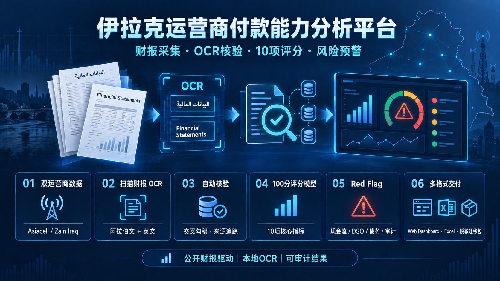

# Iraq Treasury Risk Dashboard

Internal-reference dashboard for Iraq collections and cross-border payment risk. The repository supports two modes:

- **Full local workbench:** start `server.py`, then upload scanned reports, review extracted evidence, complete missing inputs, score the 10 metrics, and apply Red Flags in the same page.
- **Static read-only dashboard:** open `index.html` or publish with GitHub Pages. Historical results remain visible, but browser-only hosting cannot run Tesseract OCR.

The OCR path is local Arabic/English processing and does not require a cloud OCR service or API key.



## Quick start

```bash
python3 tools/test_ocr_financials.py
python3 tools/test_payment_capacity.py
python3 server.py
```

Open <http://127.0.0.1:8088>, go to **扫描财报 OCR**, and use the integrated workbench. The server binds to loopback only by default.
On macOS, `start_dashboard.command` provides the same start action for Finder users.

## Data discipline

The latest public-source snapshot is dated 6 September 2026; the customer-capacity model was updated on 9 September 2026. Public figures without a newly accessible primary-source update are explicitly labelled **stale** and retain their original data cut-off. The dashboard reports collection-risk level, direction, A/B/C/D scores, and attribution; it does not estimate collection days.

Layer C now uses a 10-metric, 100-point customer payment-capacity model covering liquidity, cash flow, leverage, debt service, working-capital days, and our exposure. Good / average / risk bands receive 100 / 60 / 0 points before weighting. The model produces a score only when all 10 metrics are valid. Any confirmed Red Flag reduces the final A–D rating by at least one grade. Until the required customer financials and our AR are supplied, Layer C remains unavailable rather than being treated as zero.

Use `customer_payment_capacity_model.csv` as the machine-readable rule table. The OCR-enabled, formula-driven Excel model is stored at `outputs/payment-capacity-ocr-20260910/customer_payment_capacity_model_ocr.xlsx`.

The live scoring engine is `tools/payment_capacity.py`. It accepts only `verified*` OCR values or explicit analyst overrides. “FCF close to zero” defaults to ±1% of revenue and is adjustable in the workbench. A formal total is returned only when all 10 metrics are available.

## Scanned financial report OCR

The local pipeline detects image-only PDFs, renders each page, runs Arabic + English Tesseract OCR, extracts candidate financial rows, and applies three output states:

- `verified*`: may flow into the Excel scoring model.
- `review*`: retained as a candidate but blocked from scoring until its accounting scope is confirmed.
- `missing`: remains blank and is never converted to zero.

By default, only financial-row evidence, page numbers, confidence, document hashes, and validation results are retained. Full-page OCR text and source PDFs are not included, which avoids carrying signatures, names, phone numbers, or other incidental personal information into the migration package. Use `--retain-raw` only in a controlled local directory when full text is genuinely required.

Prerequisites: Python 3, Tesseract, and Poppler (`pdftoppm`). The Arabic Tesseract model is bundled under `tools/tessdata/`; the system English model is reused.

```bash
python3 tools/ocr_financials.py /path/to/scanned-report.pdf \
  --output-dir outputs/ocr-run
```

Reviewed fixtures for the official H1 2026 Asiacell and Zain Iraq scans are keyed to each PDF's SHA-256 in `tools/ocr_profiles.json`. If a source file changes, reviewed values are automatically downgraded to a hash-mismatch review state. Current sample outputs are under `outputs/ocr-verified-20260910/`.

## Integrated API

`server.py` serves the existing dashboard and same-origin local APIs:

- `GET /api/health`: OCR dependencies, limits, profiles, field labels, and Red Flags.
- `POST /api/ocr`: PDF upload, local OCR, reviewed-profile matching, financial checks, and initial score.
- `POST /api/score`: analyst-confirmed overrides, 10-metric calculation, and Red Flag downgrade.
- `GET /api/runs/latest`: reload the latest privacy-minimised local result.

Uploads are capped at 30 MB and 80 pages. Only one OCR job runs at a time. Uploaded source PDFs live in a temporary directory and are deleted after processing; full-page OCR text is not retained. Privacy-minimised live outputs are written under `outputs/live/`, which is excluded from Git.

See `MIGRATION.md` for deployment, privacy, and verification steps.

## Weekly refresh

Append (do not overwrite) a row in `iraq_treasury_history.csv`, add a quarter only when an official filing is available, and update the values embedded in `index.html`. Do not substitute EBITDA−Capex for FCF: the capacity model requires CFO−Capex.
